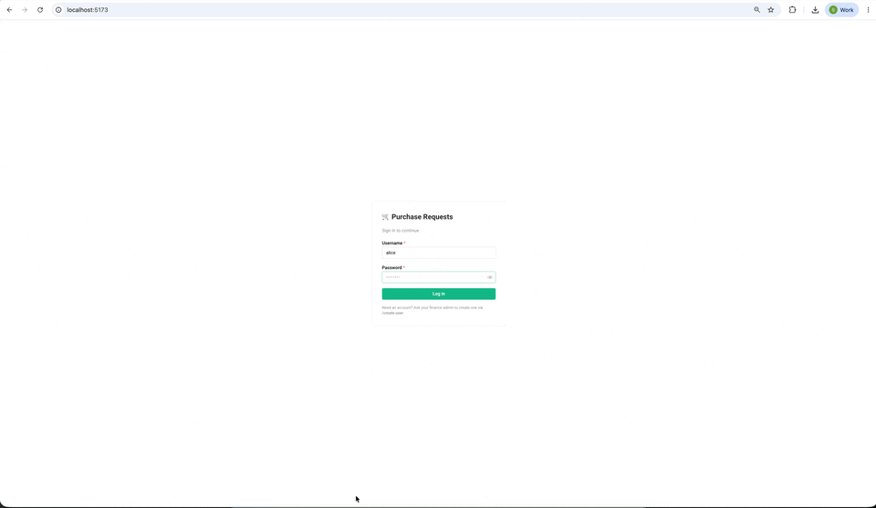
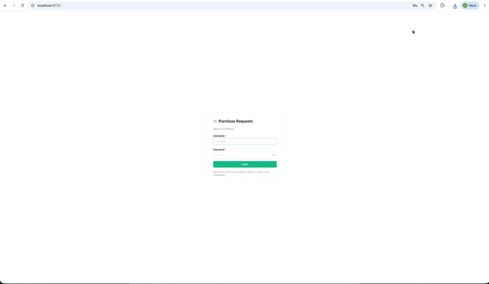

# Senior Developer Case Study

Two small business apps you'd find in any growing company, sharing nothing but a problem.

| App               | What it does                                                                      | Stack                                             |
| ----------------- | --------------------------------------------------------------------------------- | ------------------------------------------------- |
| **`pr-app`**      | Employees raise purchase requests, send them for approval, finance approves them. | React + Vite (front), FastAPI + SQLAlchemy (back) |
| **`invoice-app`** | Finance team uploads supplier invoices and tracks how much has been paid.         | React + Vite (front), Java + Spring Boot (back)   |

Both backends speak HTTP. Both happen to point at the same Postgres database. Neither one knows the other exists.

---

## The business process today

Most of this happens by hand, by email, and in spreadsheets. Here is what a single purchase actually looks like end-to-end.

1. **Request.** An employee opens the **Purchase Request system** and creates a PR — request name, supplier name and email, free-text description. The PR starts in `initiated`.
2. **Send for approval.** The employee flips the PR to `sent for approval` and emails finance the exported PDF with the PR number in the subject line. There is no notification — finance only knows there is something to approve because the email landed.
3. **Approve.** A finance manager opens the PR app separately, hunts for the PR by number, reads it, and switches the status to `approved`. They reply to the email. Again, no notification back to the employee — the employee periodically refreshes the PR app to see if their request has moved.
4. **Send to supplier.** Once approved, the employee emails the PR PDF to the supplier.
5. **Invoice arrives.** The supplier issues an invoice. Depending on their terms it goes one of three ways:
   - back to the employee for **prepayment**, which they forward to `finance@our-company.com`;
   - directly to `finance@our-company.com` for payment;
   - after goods/services are delivered, as a **post-payment** invoice.
6. **Register invoice.** A finance team member opens the **Invoice Payment system**, manually creates an invoice record, types in the supplier and the PR number from the email, attaches the PDF, sets the status (`created`, `prepaid`, or `paid` depending on what was paid so far), and fills in `invoice_sum` / `invoice_sum_paid`.
7. **Export and pay.** Finance exports the invoice to the correspondent bank for payment.
8. **Track outside both systems.** Because the two apps don't talk to each other, finance keeps a separate spreadsheet to reconcile approval status (from system 1) with payment status (from system 2). Employees ping `#finance` on Slack to ask whether their PR has been paid yet.

Communication between everyone in this loop happens either in a shared Slack channel with finance, or — more often — by email.

### Purchase request demo



### Invoice payment demo


---

## What's painful today

The process above is fragile in specific, well-known ways.

1. **The two systems are not integrated.** Exporting a PR, emailing it to finance, finance finding it again in the other system, all by hand — it takes time and it loses requests. To track what is at which stage, somebody exports both systems to Excel and joins them by hand. Employees have to poll the PR app to find out when something is approved. Finance burns hours just navigating the PR app to figure out what they should look at next.
2. **No real user and role management.** Both apps have a `role` column with two values and that's it. There is no admin UI, no audit trail, no concept of teams, no per-team budgets.
3. **No shared supplier list.** Both systems store the supplier name as free-text on every record. The same supplier shows up four different ways across the database, and finance has no place to keep the supplier's bank details, tax id, payment terms.
4. **No tracking between requested / prepaid / paid.** The PR doesn't carry a "remaining to pay" amount. The invoice has `invoice_sum` and `invoice_sum_paid` but nothing reconciles those against the original request.
5. **An ERP is coming.** Soon a third system, an **ERP**, will sit in this flow. After PR approval, the employee will ask the procurement team to cut a **purchase order** in the ERP, wait for it, and send the PO to the supplier instead of the PR PDF. When finance later gets the invoice, they'll have to identify which PO it belongs to and flag any deltas between what was ordered and what was actually invoiced. None of the current tooling has any concept of a purchase order.

---

## The case study

There are three deliverables we expect from you.

1. **Design and (ideally) prototype the integration** between the PR system, the invoice system, and the incoming ERP. We do not expect production code — diagrams, a written design doc, and either a working spike or a focused PR that shows the direction are all fair game. Be opinionated about boundaries, contracts, ownership, and how state flows.
2. **List the improvements** you would make to each of the two existing systems on its own, given what the code looks like today. The codebase is intentionally rough — see _What's intentionally rough_ below for a starter list, but please don't stop there.
3. **List the potential features** each system should grow into, in the broader scope (supplier domain, user/role management, budgets, ERP, PO matching, notifications, audit, reporting). Tell us what you'd build, in what order, and why.

There is no fixed time limit. We expect senior candidates to spend somewhere between half a day and a long weekend on this, depending on how far they push the prototype. Quality of judgement matters more than line count.

---

## Repo layout

```
.
├── pr-app/
│   ├── back/         FastAPI + SQLAlchemy + uv
│   └── front/        React + Vite + Mantine
├── invoice-app/
│   ├── back/         Java 17 + Spring Boot 3 + JPA
│   └── front/        React + Vite + Mantine
├── docs/
│   └── figma.md      Pointer to the Figma wireframes for both apps
├── docker-compose.yml
└── README.md
```

Each app has its own `README.md` with the local-dev instructions for that piece.

## Running everything

```bash
docker compose up --build
```

The compose stack brings up, in order:

```
db  →  init-db  →  seed-users  ┬→  pr-app-back       →  pr-app-front       (:5173)
                               └→  invoice-app-back  →  invoice-app-front  (:5174)
```

`init-db` and `seed-users` are one-shot containers (`restart: "no"`); the long-running services wait on `condition: service_completed_successfully`.

Once the stack is up:

| Service                                 | URL                                                            |
| --------------------------------------- | -------------------------------------------------------------- |
| PR app (frontend)                       | http://localhost:5173                                          |
| PR app — OpenAPI docs (FastAPI)         | http://localhost:8001/docs                                     |
| Invoice app (frontend)                  | http://localhost:5174                                          |
| Invoice app — OpenAPI docs (Swagger UI) | http://localhost:8002/swagger-ui.html                          |
| Postgres                                | `localhost:5432`, db `casestudy`, user `postgres` / `postgres` |

## Seed users

The `seed-users` one-shot container inserts three accounts. Idempotent — re-running it is a no-op.

| Username | Password    | Role     |
| -------- | ----------- | -------- |
| alice    | password123 | employee |
| bob      | password123 | employee |
| finadmin | password123 | finance  |

The invoice app only accepts users with role `finance`. The PR app accepts both roles but exposes different actions to each.

If you run a backend outside Docker, point it at a reachable Postgres via `DATABASE_URL` (or `POSTGRES_HOST` / `POSTGRES_USER` / `POSTGRES_PASSWORD` / `POSTGRES_DB`). See each backend's README for details.

---

## What's intentionally rough

This repo is the "before" picture. Among other things:

- The two apps share the same Postgres database, but neither owns the schema cleanly. The PR backend's `init-db` job is the only one running migrations; the invoice backend creates its own tables on first boot via Hibernate `ddl-auto: update`.
- The PR app stores supplier name and email as free-text on every request. There is no `suppliers` table.
- The invoice app stores the linked PR number as a free-text string — no foreign key, no validation, no cross-check that the PR even exists.
- Auth is a hand-rolled opaque token in an http-only cookie. There is a session table per app, no refresh, no rotation, no real expiry handling. The two apps don't share sessions; logging into one does not log you into the other.
- There is no integration between the two apps. None.
- Tests are sparse.
- There is no CI.

These are the rocks under the surface. Some of them are on purpose, some of them are just where a real, busy team would have left things. Treat them as your starting list — they are not exhaustive.

---

## Handing it back

The case study is delivered as a GitHub repo. To submit your work:

1. **Fork** this repository to your own GitHub account.
2. Work in **feature branches** off `main`. One branch per discrete piece of work tends to read best — for example:
   - `feat/integration-spike` — your integration prototype
   - `docs/architecture` — the design doc, diagrams, decision notes
   - `chore/improvements-pr-app` — concrete improvements to one of the existing apps
   - `chore/improvements-invoice-app` — the same for the other
3. **Open pull requests** from your fork back to this repository's `main`. Smaller, focused PRs are easier to review than one giant one. It's fine if some PRs are draft / proof-of-concept — say so in the description.
4. In each PR description, tell us:
   - What problem this PR addresses (link the section of this README or your design doc).
   - What's in scope vs. what you intentionally left out, and why.
   - What you would do next if you had another week.
5. **Written design** — diagrams, architecture decisions, ERP onboarding plan, supplier domain model, anything else you want us to read — lives in `docs/` (or a top-level `DESIGN.md`). Markdown is fine; if you'd rather link out to a Figma or a Miro board, do that and include the link in the PR description. Make sure the link is publicly viewable or invite `s.nagorny@all3.com` if it's gated.
6. When you're done, drop a note to `s.nagorny@all3.com` with links to your fork and the PRs you'd like us to review.

We are looking less for "did you finish it all" and more for **how you decompose the problem, where you draw the boundaries, and what trade-offs you make explicit**. A small, sharp PR with a great design doc beats a sprawling rewrite every time.

Good luck.
