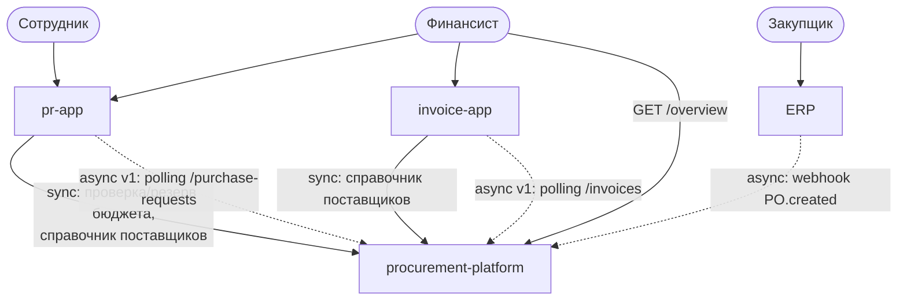
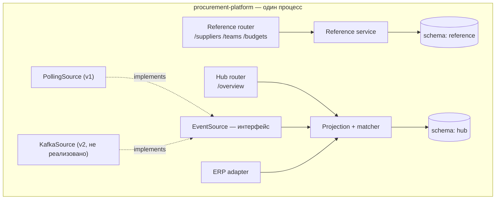
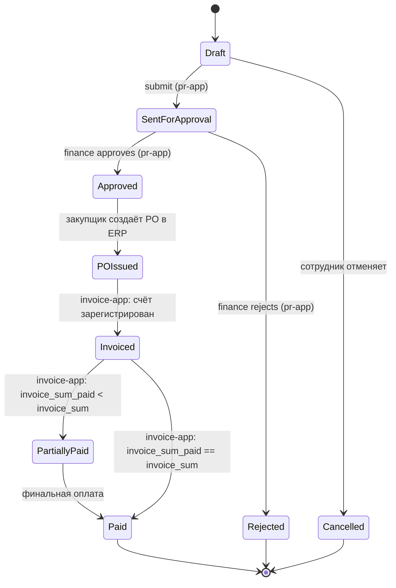
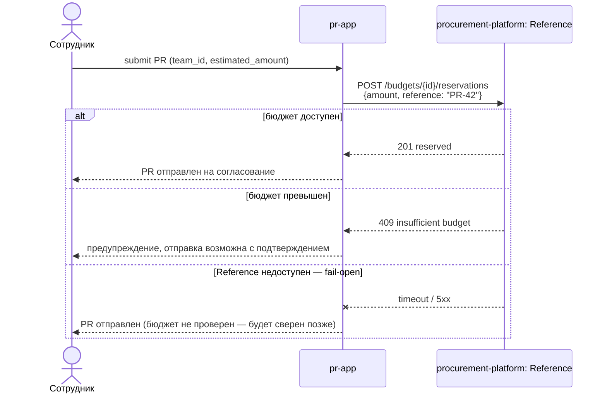
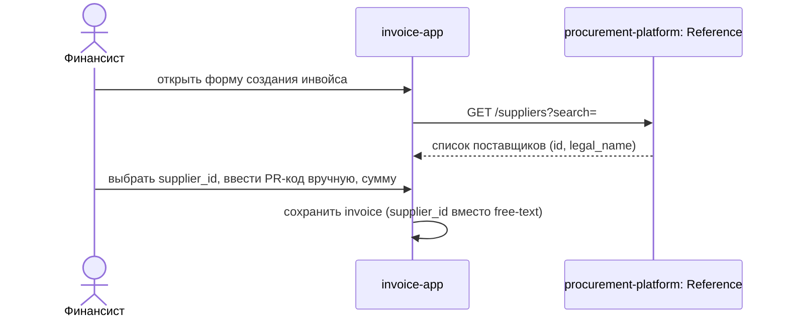
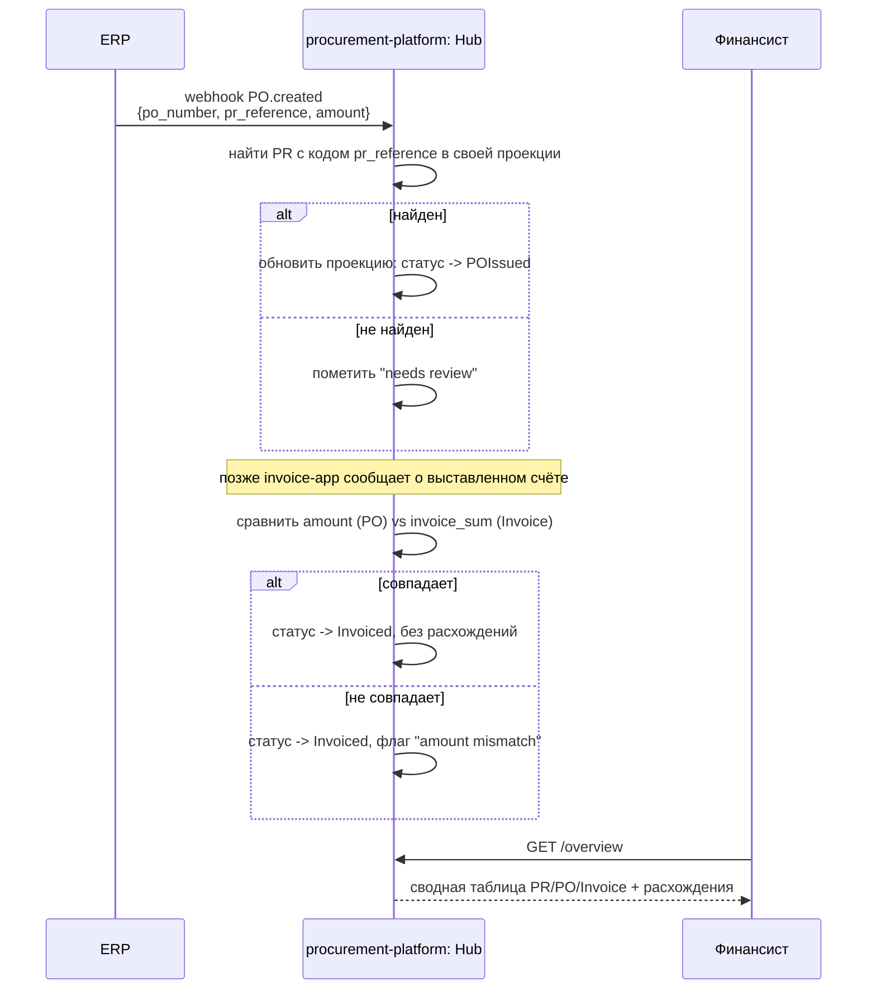
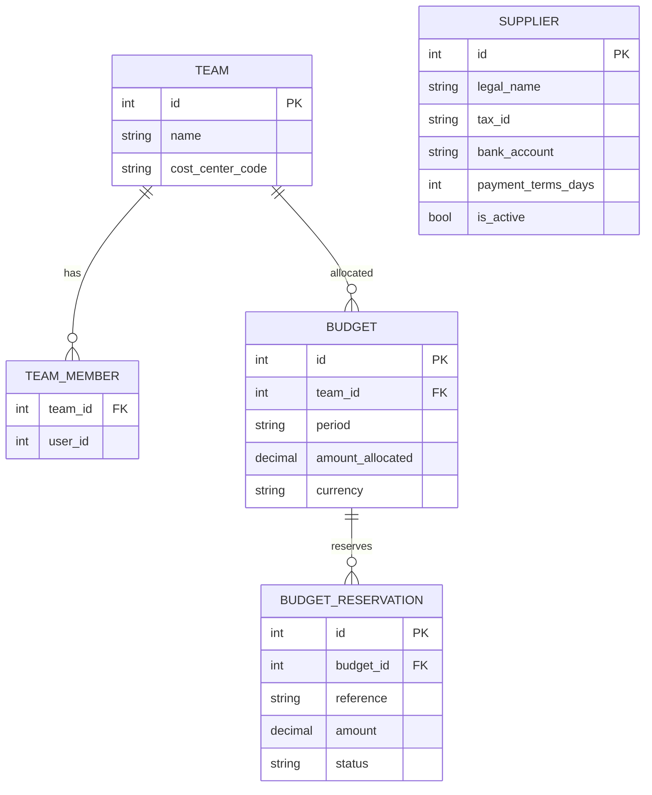

# Диаграммы решения

Все диаграммы — в Mermaid, GitHub рендерит их прямо в превью markdown, без
внешних инструментов. Каждая диаграмма сопровождается пояснением: что на ней,
зачем она нужна и почему сделана именно так.

## 1. Контекст: кто с кем взаимодействует

**Что показано.** Три категории связей: (1) сплошные — синхронные вызовы,
где ответ нужен прямо сейчас (бюджет, справочник); (2) пунктирные — асинхронный
поток данных о статусе (poll или webhook); (3) `procurement-platform` —
новый узел, владеющий межсистемными сущностями.

**Почему не "труба между pr-app и invoice-app".** pr-app и invoice-app
сегодня не общаются друг с другом вообще, и в новой схеме тоже не должны —
у них нет общих данных, которые нужно "передавать" друг другу напрямую. Оба
независимо обращаются к `procurement-platform` как клиенты — это hub-and-spoke,
а не релей.

## 2. Компоненты внутри `procurement-platform`

**Что показано.** Внутренняя граница между `reference` и `hub` — по схемам
БД, не только по папкам в коде. `EventSource` — точка расширения (Strategy
pattern): `Projection` работает с любым источником событий одинаково, не
зная, поллинг это или Kafka. Это и есть механизм, который снимает дилемму
"Kafka сейчас или никогда" — переключение между `PollingSource` и
`KafkaSource` это замена одного класса в DI-конфиге, без переписывания
бизнес-логики сверки.

**Почему `KafkaSource` показан, но помечен "не реализовано".** Чтобы явно
зафиксировать: архитектура к этому готова, но мы не платим цену
инфраструктуры за объём, которого нет — см. `README.md`, раздел про scope cuts.

## 3. Жизненный цикл закупки (вид Hub — синтетическая проекция)

**Что показано.** Это состояние не существует целиком ни в одной из трёх
систем — оно собирается Hub'ом из кусочков: `pr-app` знает про
`Draft → Approved/Rejected`, ERP знает про `POIssued`, `invoice-app` знает
про `Invoiced → Paid`. Именно отсутствие этой сводной картины и есть боль
№1 из README ("кто-то экспортирует в Excel и объединяет вручную").

**Почему это не настоящий FSM с явными переходами, а "наблюдаемая"
проекция.** Hub не управляет переходами — он их распознаёт постфактум по
данным, пришедшим от трёх систем (через polling-diff или webhook). Если
`pr-app` когда-нибудь введёт промежуточный статус, которого Hub не ожидает,
эта строка просто попадёт в "needs review" в дашборде — деградация
контролируемая, не падение.

## 4. Последовательность: отправка PR с резервированием бюджета

**Почему резервирование, а не просто проверка.** Проверка-и-списание одной
операцией (`SELECT ... FOR UPDATE` внутри `POST /reservations`) убирает race
condition: два сотрудника одновременно проверяют "бюджет есть", оба создают
PR — без атомарного резервирования бюджет уйдёт в минус.

**Почему ветка fail-open, а не блокировка.** Описано в `README.md` —
доступность процесса согласования PR не должна зависеть от аплейма нового
вспомогательного сервиса жёстче, чем сейчас.

## 5. Последовательность: создание инвойса со справочником поставщиков

**Что меняется относительно текущего кода.** Единственное затрагиваемое
поле в `invoice-app` — поставщик: было свободное текстовое поле, становится
выбор из дропдауна, заполненного из Reference. Поле `purchaseRequestNumber`
остаётся как сейчас (free-text) — описано в README, почему это
сознательный compromise, а не недосмотр.

## 6. Последовательность: ERP создаёт PO, Hub сверяет с инвойсом

**Это и есть закрытие боли №5** ("ни один из существующих инструментов не
имеет понятия о заказе на покупку") — PO как сущность впервые появляется
именно здесь, и расхождения между заказанным и выставленным к оплате
становятся видимыми автоматически, а не находятся постфактум бухгалтером.

## 7. Модель данных Reference-модуля

**Почему `SUPPLIER` не связан стрелками с остальными.** Это независимый
справочник, используемый по `id` снаружи (`pr-app`, `invoice-app`, `hub`) —
он не должен знать о бюджетах и командах, иначе теряется смысл разделения.

**Почему `user_id` в `TEAM_MEMBER`, а не FK на `users`.** `procurement-platform`
не должен знать схему чужой БД — ровно та граница, которую мы создаём,
разрывая текущий анти-паттерн "shared database" (Java-сервис читает таблицу
`users` напрямую — см. `IMPROVEMENTS.md`).

**Почему `BUDGET_RESERVATION` отдельной таблицей, а не счётчиком в `BUDGET`.**
Уникальный constraint `(budget_id, reference)` даёт идемпотентность повторных
вызовов бесплатно — и попутно журнал "что списало бюджет", что частично
закрывает потребность в audit trail (боль №2), хотя полноценным audit log
это не является.
